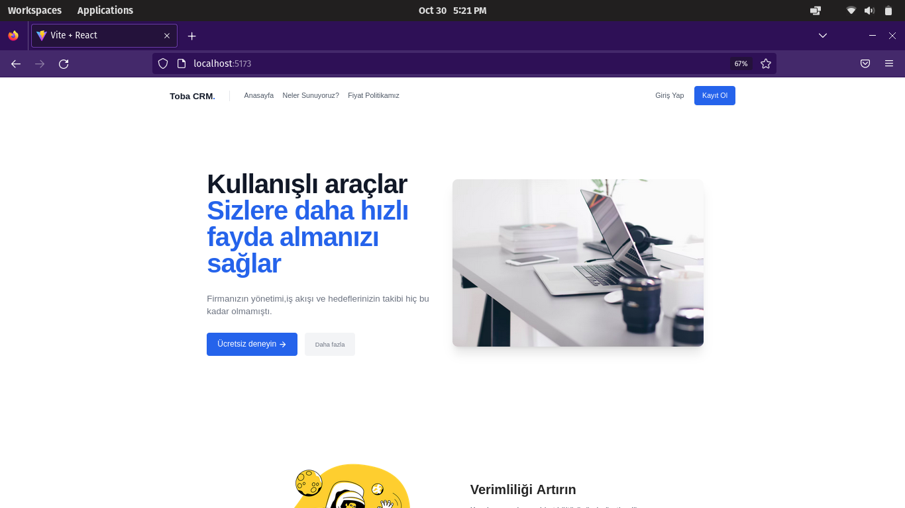
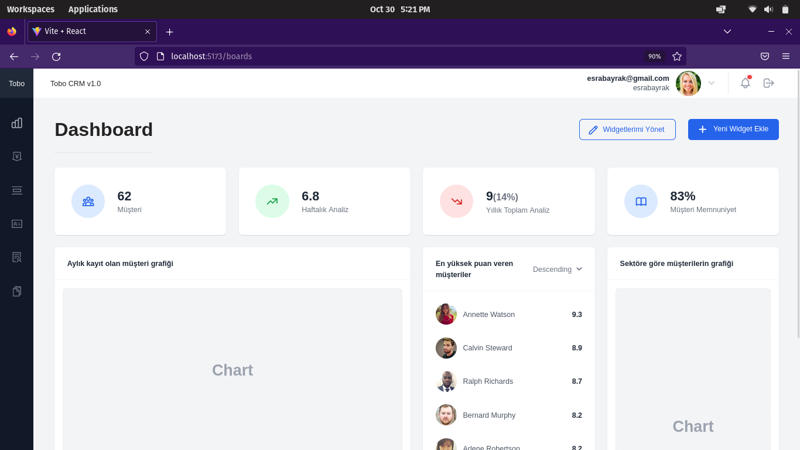
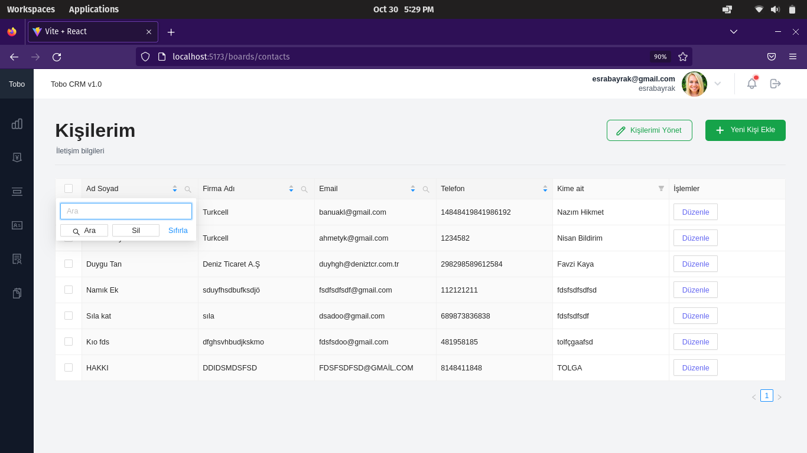
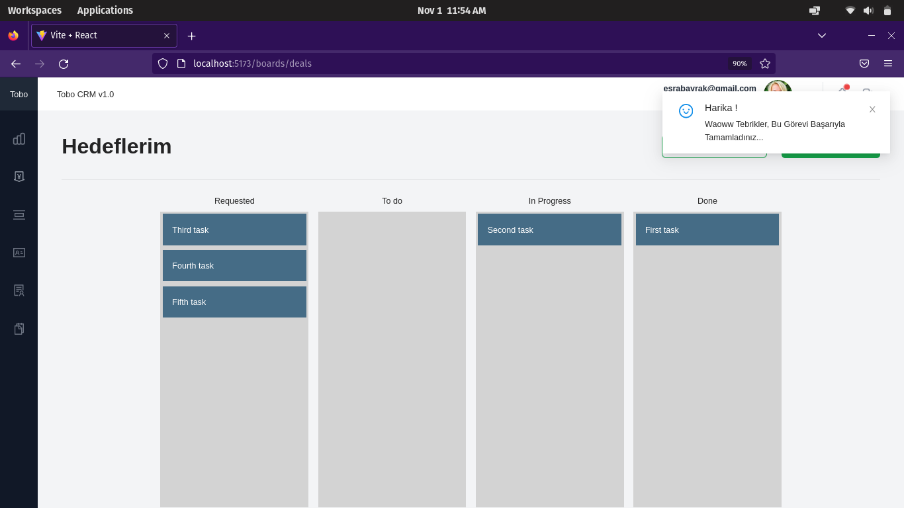

# Tobo CRM V1.0
## _Customer And Business Management Application_


</img>
</img>
</img>

##Drag and drop pipelines
</img>


## Tech

Dillinger uses a number of open source projects to work properly:

- ReactJS
- Ant Design and TailwindCSS
- NodeJs 
- ExpressJS
- MongoDB


## Installation

Dillinger requires [Node.js](https://nodejs.org/) v14+ to run.

Install the dependencies and devDependencies and start the server(client).

```sh
cd client
npm install
npm run dev
```

Install the dependencies and devDependencies and start the server(server).

```sh
touch .env
env=your enviroments(DB_CONNECTION,JWTSECRETKEY etc.)
npm install
npm start
```

